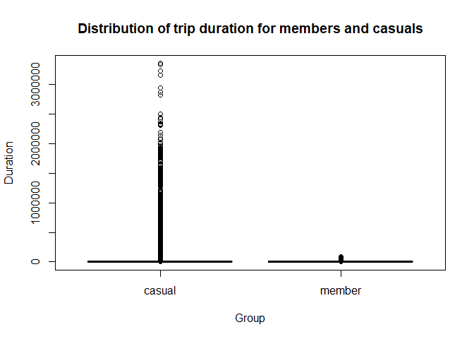
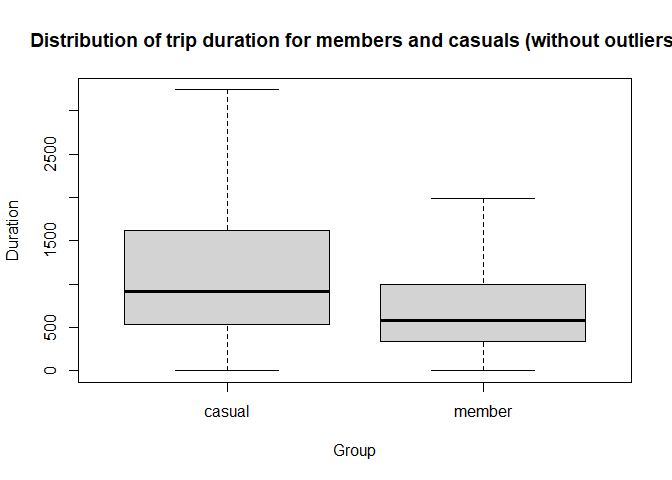

Cyclictic Bike Sharing
================
Diji
12/19/2021

# Business task

The primary goal of the company is to maximize the number of annual
memberships.To facilitate this process, the marketing teams would like
the following three questions answered:

-   How do annual members and casual riders use Cyclistic bikes
    differently?
-   Why would casual riders buy Cyclistic annual memberships?
-   How can Cyclistic use digital media to influence casual riders to
    become members?

The specific task given to me is to answer the question - how do annual
members and casual riders use Cyclistic bikes differently?

# Data Sources

The data was downloaded from this link
[here](https://divvy-tripdata.s3.amazonaws.com/index.html), and is the
file that was updated on Dec 8, 2021. The data was made available by
Motivate International Inc. 

# Analysis

``` r
# Import the packages 
if (!require(pacman)) {
  install.packgages(pacman)
}

pacman::p_load(janitor, skimr, tidyverse, data.table)
```

# Summary

``` r
# Get a summary of the table 
skimr::skim(bike_trips)
```

|                                                  |             |
|:-------------------------------------------------|:------------|
| Name                                             | bike\_trips |
| Number of rows                                   | 10709864    |
| Number of columns                                | 14          |
| Key                                              | NULL        |
| \_\_\_\_\_\_\_\_\_\_\_\_\_\_\_\_\_\_\_\_\_\_\_   |             |
| Column type frequency:                           |             |
| character                                        | 7           |
| numeric                                          | 5           |
| POSIXct                                          | 2           |
| \_\_\_\_\_\_\_\_\_\_\_\_\_\_\_\_\_\_\_\_\_\_\_\_ |             |
| Group variables                                  | None        |

Data summary

**Variable type: character**

| skim\_variable       | n\_missing | complete\_rate | min | max | empty | n\_unique | whitespace |
|:---------------------|-----------:|---------------:|----:|----:|------:|----------:|-----------:|
| ride\_id             |          0 |           1.00 |  16 |  16 |     0 |   5479096 |          0 |
| rideable\_type       |          0 |           1.00 |  11 |  13 |     0 |         3 |          0 |
| start\_station\_name |    1287740 |           0.88 |   3 |  53 |     0 |       845 |          0 |
| start\_station\_id   |    1287734 |           0.88 |   3 |  36 |     0 |       831 |          0 |
| end\_station\_name   |    1371056 |           0.87 |  10 |  53 |     0 |       839 |          0 |
| end\_station\_id     |    1371056 |           0.87 |   3 |  36 |     0 |       826 |          0 |
| member\_casual       |          0 |           1.00 |   6 |   6 |     0 |         2 |          0 |

**Variable type: numeric**

| skim\_variable | n\_missing | complete\_rate |   mean |     sd |     p0 |    p25 |    p50 |     p75 |    p100 | hist  |
|:---------------|-----------:|---------------:|-------:|-------:|-------:|-------:|-------:|--------:|--------:|:------|
| start\_lat     |          0 |           1.00 |  41.90 |   0.05 |  41.64 |  41.88 |  41.90 |   41.93 |   42.07 | ▁▁▇▇▁ |
| start\_lng     |          0 |           1.00 | -87.65 |   0.03 | -87.84 | -87.66 | -87.64 |  -87.63 |  -87.52 | ▁▁▆▇▁ |
| end\_lat       |       5491 |           1.00 |  41.90 |   0.05 |  41.39 |  41.88 |  41.90 |   41.93 |   42.17 | ▁▁▁▇▁ |
| end\_lng       |       5491 |           1.00 | -87.65 |   0.03 | -88.97 | -87.66 | -87.64 |  -87.63 |  -87.49 | ▁▁▁▁▇ |
| duration       |    5479096 |           0.49 | 899.00 | 691.96 |   1.00 | 397.00 | 694.00 | 1203.00 | 3601.00 | ▇▅▂▁▁ |

**Variable type: POSIXct**

| skim\_variable | n\_missing | complete\_rate | min                 | max                 | median              | n\_unique |
|:---------------|-----------:|---------------:|:--------------------|:--------------------|:--------------------|----------:|
| started\_at    |          0 |              1 | 2020-12-01 00:01:15 | 2021-11-30 23:59:56 | 2021-07-25 16:54:42 |   4574825 |
| ended\_at      |          0 |              1 | 2020-11-25 07:40:56 | 2021-12-02 06:41:33 | 2021-07-25 17:16:22 |   4568129 |

The Data Summary table above provides a general description of the data.
There are 13 columns; 7 of character type, 4 of numeric type, and 2 of
POSIXct i.e. datetime type. These variables are of appropriate format
for analysis. The table contains missing data as shown in the
“n\_missing” column.

From the table above, the ride\_id seems to be the unique identifier for
the trips given the number of rows in the table and the no of ride ids.
The unique types of bike rides are: classic\_bike, electric\_bike,
docked\_bike. The types of members are member, casual, and is primary in
answering our question of how the different member types utilize
Cyclistic.

Some bits of information to evaluate differences between the two groups
- members and casuals - include

-   the duration of trips
-   the distribution of trip count among different temporal granularity
    e.g.days of the week, and months of the year.
-   ride type preferences
-   the locations where the different membership types emanate from
-   view combinations to answer questions such as what bike type do the
    different member groups prefer at location A.

# How do the different bike groups differ based on the duration of trips

``` r
bike_trips %>%
  select(member_casual, started_at, ended_at) %>% 
  mutate(duration = ended_at - started_at) %>%
  group_by(member_casual) %>%
  summarise(min_duration = min(duration), median_duration = median(duration), average_duration = mean(duration), stdev_duration = sd(duration), max_duration = max(duration))
```

    ## # A tibble: 2 x 6
    ##   member_casual min_duration  median_duration average_duration stdev_duration
    ##   <chr>         <drtn>        <drtn>          <drtn>                    <dbl>
    ## 1 casual        -1739755 secs 920 secs        1501.8824 secs           13413.
    ## 2 member        -1742998 secs 581 secs         702.9998 secs           12227.
    ## # ... with 1 more variable: max_duration <drtn>

From the above, we see the presence of negative duration. As this does
not make any logical sense, we will exclude the trips of negative
duration. As mentioned above, there are also trips with missing
information such as start and end station names. These trips will not be
excluded (yet) from analysis because although they fail to inform on the
spatial use of Cyclistic, they do inform on the temporal use. In a real
life scenario, the team will investigate the presence of these null
values as they may be erroneous data or data from software testing etc.

To further evaluate if these null values should be excluded, we can
compare summary statistics of both cases.

``` r
# Get clean data 
bike_trips_clean <- bike_trips %>% 
  mutate(duration = ended_at - started_at) %>%
  filter(duration > 0)
```

When negative durations are dropped, the no of trips reduces from
10709864 to 10708790 i.e it reduces by -98.9899719

``` r
# Summary statistics without NAs present 
bike_trips_clean %>% 
  drop_na() %>% 
  mutate(duration = ended_at - started_at) %>%
  group_by(member_casual) %>%
  summarise(min_duration = min(duration), median_duration = median(duration), average_duration = mean(duration), stdev_duration = sd(duration), max_duration = max(duration))
```

    ## # A tibble: 2 x 6
    ##   member_casual min_duration median_duration average_duration stdev_duration
    ##   <chr>         <drtn>       <drtn>          <drtn>                    <dbl>
    ## 1 casual        1 secs       953 secs        1560.0946 secs           11951.
    ## 2 member        1 secs       586 secs         775.8254 secs             855.
    ## # ... with 1 more variable: max_duration <drtn>

``` r
# Summary statistics with NAs present
bike_trips_clean %>% 
  mutate(duration = ended_at - started_at) %>%
  group_by(member_casual) %>%
  summarise(min_duration = min(duration), median_duration = median(duration), average_duration = mean(duration), stdev_duration = sd(duration), max_duration = max(duration))
```

    ## # A tibble: 2 x 6
    ##   member_casual min_duration median_duration average_duration stdev_duration
    ##   <chr>         <drtn>       <drtn>          <drtn>                    <dbl>
    ## 1 casual        1 secs       920 secs        1530.4986 secs           11448.
    ## 2 member        1 secs       581 secs         789.2442 secs            1255.
    ## # ... with 1 more variable: max_duration <drtn>

``` r
# Print the number of rows if NAs are dropped
bike_trips_clean %>% 
  drop_na() %>% 
  nrow()
```

    ## [1] 8835160

Comparing the summary statistics with and without the NAs, we observe
ever slight differences between both cases. If we were to drop the rows
the missing data, we’d be left with 4525274 rows, which is a 17.4083827%
decrease in the data. Based on the above information, we will not be
excluding the NAs from the data set, as additionally, it does not hinder
us from attaining information from locations with labels.

``` r
# Box-plot data for trips with and without outliers 
trips_w_outliers <- boxplot(duration ~ member_casual, data = bike_trips_clean, outline = T, main = "Distribution of trip duration for members and casuals", xlab = "Group", ylab = "Duration")
```

<!-- -->

``` r
trips_wo_outliers <- boxplot(duration ~ member_casual, data = bike_trips_clean, outline = F, main = "Distribution of trip duration for members and casuals (without outliers)", xlab = "Group", ylab = "Duration")
```

<!-- -->

Noteworthy information from the visual above is that casuals tend to
have longer trips than members.

``` r
# Print out summary statistics
trips_wo_outliers$stats
```

    ##      [,1] [,2]
    ## [1,]    1    1
    ## [2,]  533  338
    ## [3,]  920  581
    ## [4,] 1616  999
    ## [5,] 3240 1990

``` r
# How many rows will there be if outliers were excluded 
bike_trips_clean %>% 
  filter(duration <= 3601) %>% 
  nrow()
```

    ## [1] 10461536

If we exclude outliers, we’d be left with approximately 95% of our data,
as such, we will proceed to exclude outliers from our analysis.

``` r
# Exclude outliers from the dataset 
bike_trips_clean <- bike_trips_clean %>% 
  filter(duration <= 3601)
```

``` r
# Duration summary with outlier excluded 
bike_trips_clean %>% 
  group_by(member_casual) %>%
  summarise(min_duration = min(duration), median_duration = median(duration), average_duration = mean(duration), stdev_duration = sd(duration), max_duration = max(duration))
```

    ## # A tibble: 2 x 6
    ##   member_casual min_duration median_duration average_duration stdev_duration
    ##   <chr>         <drtn>       <drtn>          <drtn>                    <dbl>
    ## 1 casual        1 secs       877 secs        1090.6493 secs             769.
    ## 2 member        1 secs       578 secs         752.5328 secs             586.
    ## # ... with 1 more variable: max_duration <drtn>

Now that outliers have been excluded, we will proceed to do further
analysis and visualizations in Tableau.

# Visualizations and key findings

<div class="figure">


<p class="caption">
Trip insights
</p>

</div>

# Insights

-   Most trips occur within the Chicago area
-   Casual users mostly utilize cyclistic during the weekend while
    members mostly utilize Cyclistic during the weekday
-   Regardless of whether the user is a Casual or Member, Cyclistic is
    mostly utilized during the summer.

# Recommendations

A possible technique to increase membership could be to run campaigns or
marketing initiatives for casual members during the weekend of the
summer months.
